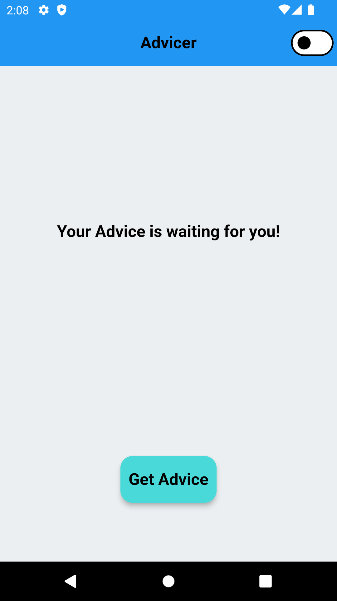
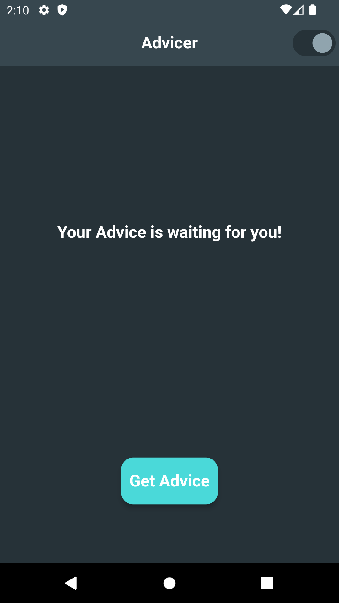
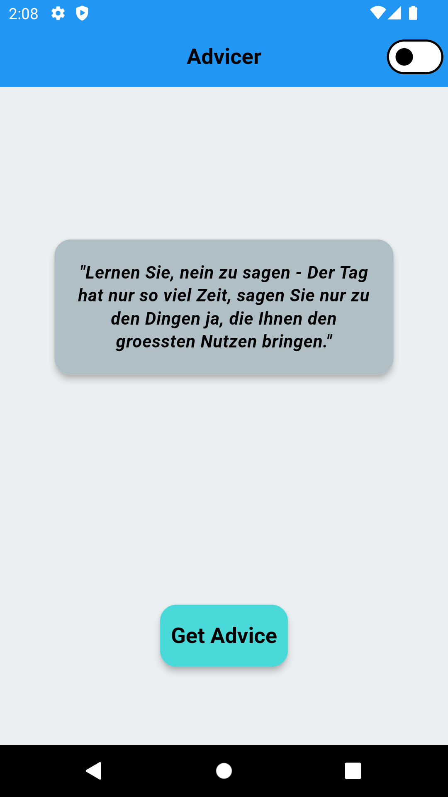
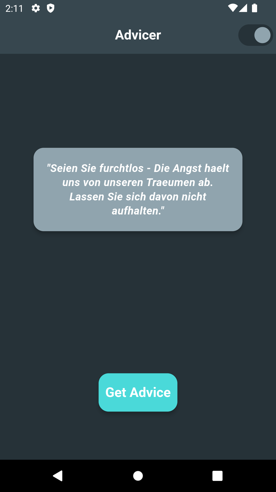
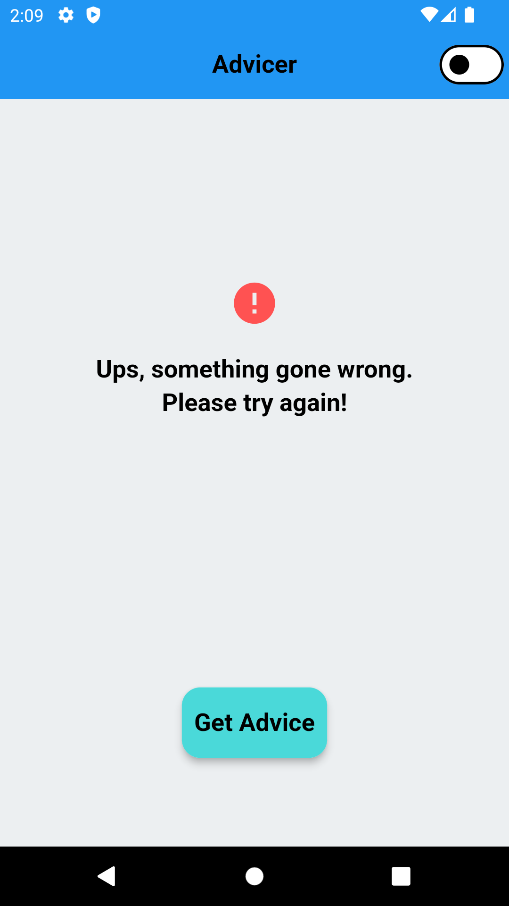
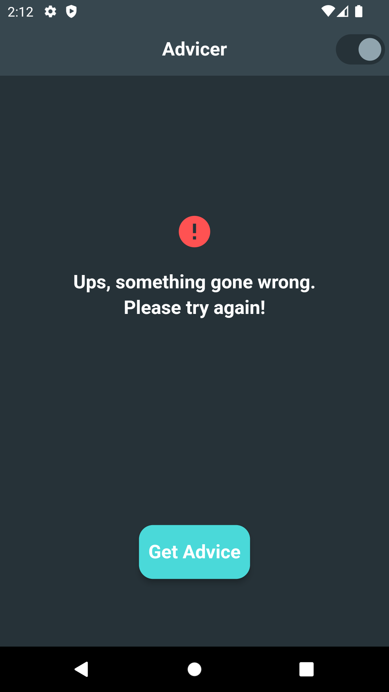

<h1> Advicer </h1>

A simple Flutter Android application to get random advice with one tap. This project Built to learn Flutter Clean Architecture and BLoC Pattern.

<h2> ⚙️ Technologies </h2>
<ul>
  <li>Flutter Clean Architecture and BLoC Pattern.</li>
  <li>HTTP GET request.</li>
</ul>

<h2> 🔥 Features </h2>
<ul>
  <li>Retrieve random advice with a single tap.</li>
  <li>Support light & dark mode.</li>
</ul>

<h2> 📸 Screenshots </h2>

 

 

 

<h2> 👽 Author </h2>
<a href="https://www.imashasenarath.com/" target="_blank"><strong>Imasha Senarath</strong></a>
